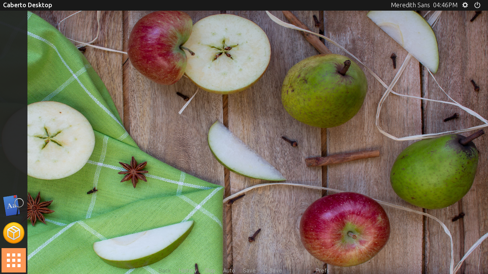

The first feature update to the full Unscripted, v2.1.0, is available for general testing. This release can be downloaded from GitHub or Steam through the insider beta channel.

Some notable changes in this release are: 

- Adds configurations and support for the Snap version of the game.
- Introduces Candella fork of AliceOS with new features such as multi-user support and a new desktop.
- Updates Ren'Py SDK to v7.4.2.
- Enables model-based rendering for improved OpenGL effects such as blurring.
- Resolves an issue in the story bootstrapper where some Steam achievements were not properly registered.
- Resolves an issue where the desktop could be prematurely called on the main menu.

## Install via snapcraft

Starting with this release, Unscripted is available as a snap through the Snap Store for testing. We heavily encourage those running Linux with Snap support enabled to test out this release of Unscripted. To install this package as a Snap on your machine, run the following command:

```
sudo snap install unscripted --beta
```

## Introducing Candella

**Candella** is an upcoming replacement/fork of the AliceOS framework used in Unscripted. Candella attempts to modernize some of the APIs used in AliceOS and provide a better experience for both developers and users. We hope that, by creating this fork, we can address further issues pertaining to the framework more quickly and reliably.

Some of the notable differences between Candella and AliceOS are:

- Silent booting is enabled by default so that Candella can still boot while the game is loading.
- A brand new SDK makes it easier to develop apps and core services for Candella, as well as validate existing projects.
- The AliceOS Desktop has been replaced with Caberto Shell, a Lomiri-inspired desktop shell with more customization options.
- Candella has support for switching between multiple user profiles.
- The Glossary app is included by default in Candella and now uses JSON to load dictionaries.
- Candella includes checks to verify required frameworks and their dependencies exist.
- Candella supports the new blur effects present in Ren'Py 7.4.x.



The official documentation for the project can be currently found at [https://candella.unscriptedvn.dev](https://candella.unscriptedvn.dev).

If you want to install the Candella SDK, you can run the following command to download the package from pip:

```
pip install candella-sdk
```

## Known issues

- The snap version of Unscripted will not run on virtual machines due to outdated OpenGL dependencies.
- It is not possible to delete user profiles via the Account Switcher in Caberto Shell.
- It is not possible to search in the Caberto Shell drawer.
- Some apps use the old AliceOS interface font, Inter, instead of the new default font, Ubuntu.